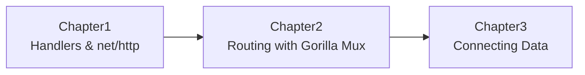

# Go Fundamentals Web Apps Book

<p align="center">
  <b>Learn Go fundamentals by building small, practical web chapters.</b><br/>
  From first handlers to routing and data-driven pages.
</p>

<p align="center">
  
  
  
</p>

---

## Learning Roadmap



## Why This Repo

- Practice Go through short, focused chapter projects.
- Build confidence with real HTTP server patterns.
- Keep a "book flow" so each chapter naturally leads to the next.

## How To Use This Repo

1. Start from Chapter 1 and move in order.
2. Read the `README.md` inside each chapter folder.
3. Run the code and test the listed routes in your browser.
4. Update notes as you learn and extend chapters with your own experiments.

## Chapters

### Chapter 1: Hello, Handlers, and Responses
[Open chapter](./1-hellow/README.md)

Build a minimal HTTP server using `net/http`, including:
- static file responses
- dynamic responses with current time
- handler function wiring with `http.HandleFunc`

### Chapter 2: Routing and URL Parameters
[Open chapter](./2-routing/README.md)

Add structured routing using Gorilla Mux:
- path params with regex matching
- route-based file selection
- fallback to `404.html` when a page is missing

### Chapter 3: Connecting Data (In Progress)
[Open chapter](./3-connecting-data/README.md)

Prepare for data-backed handlers and pages:
- move from static responses to data-aware responses
- define patterns for integrating data with routes

## Progress Tracker

- [x] Chapter 1: Basic HTTP server setup and handlers
- [x] Chapter 2: Routing and file-based page serving
- [ ] Chapter 3: Data connection fundamentals

## Quick Start

Run any chapter from its folder. Example:

```bash
cd 2-routing
go mod tidy
go run maing.go
```

Open [http://localhost:8080](http://localhost:8080) in your browser.

## Suggested Study Rhythm

- **Read:** chapter README and source
- **Run:** start server and hit endpoints
- **Reflect:** write what concept clicked
- **Repeat:** move to next chapter
